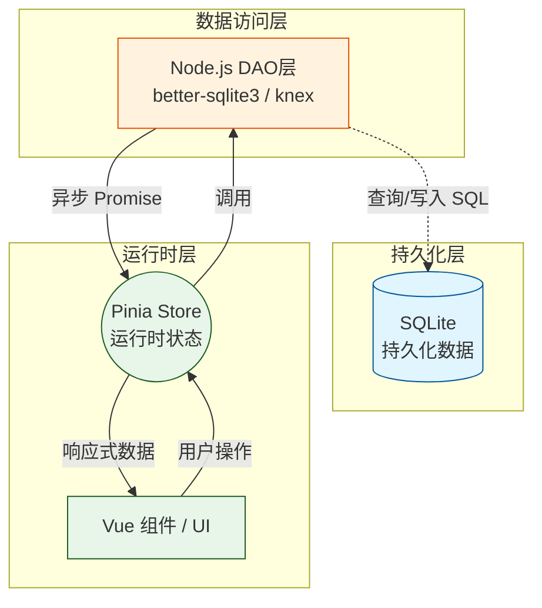

* Node.js v22.16.0
* Electron 36.5.0

对应的vue可以整合的稳定版本是？对应ElementUI可以整合的稳定版本？且需要考虑彼此之间的兼容性


请使用以下技术实现一个Electron的Demo程序

|           |                      |
| --------- | -------------------- |
| Node.js   | v22.16.0             |
| Electron  | v36.5.0              |
| Vue框架     | Vue 3.x（建议最新版 v3.3+） |
| UI组件库     | Element Plus 2.x     |
| 构建工具      | electron-vite-vue    |
| node包管理工具 | pnpm                 |

参考资料

* [如何从零开始搭建一套Electron+Vue3+Vite3+Ts的桌面客户端开发框架](https://juejin.cn/post/7201195953691983927)


# Hello Word

```sh
$ node -v
v22.18.0 <-- 版本很重要，不然可能下面创建流程会失败
```

```sh
$ npm create @quick-start/electron {projectName}
Need to install the following packages:
@quick-start/create-electron@1.0.28
Ok to proceed? (y) y


> npx
> "create-electron" frontend

✔ Select a framework: › vue
✔ Add TypeScript? … No / Yes
✔ Add Electron updater plugin? … No / Yes
✔ Enable Electron download mirror proxy? … No / Yes

Scaffolding project in /Users/wangpengbo/Projects/assistant/frontend...

Done. Now run:

  cd {projectName}
  npm install
  npm run dev
```

1. npm 下载 @quick-start/electron 脚手架包（取决于包命名方式，npm 会自动匹配）。
2. 执行里面的初始化脚本。
3. 生成一个名为 frontend 的文件夹。
4. 在文件夹里放好 Electron 模板代码 + package.json 等。
5. 可能会提示你是否安装依赖、选择模版等。

>@quick-start/electron 是官方或社区提供的 Electron 项目创建器。它会自动拉取预设的项目模板，包含 Electron 基础配置、目录结构、开发依赖等。

好慢～

# 报错

使用@quick-start/electron创建Electron项目

```sh
$ node -v
v20.11.1

$ electron-vite
assistant@1.0.0 D:\Projects\NEW\assistant
`-- electron-vite@4.0.0
```

启动报错：

```
15:29:38 [vite] Internal server error: crypto.hash is not a function
  Plugin: vite:vue
  File: D:/Projects/NEW/assistant/src/renderer/src/App.vue
      at getHash (file:///D:/Projects/NEW/assistant/node_modules/@vitejs/plugin-vue/dist/index.js:140:16)
      at createDescriptor (file:///D:/Projects/NEW/assistant/node_modules/@vitejs/plugin-vue/dist/index.js:89:23)
      at transformMain (file:///D:/Projects/NEW/assistant/node_modules/@vitejs/plugin-vue/dist/index.js:1633:33)
      at TransformContext.handler (file:///D:/Projects/NEW/assistant/node_modules/@vitejs/plugin-vue/dist/index.js:2045:27)
      at Object.transform (file:///D:/Projects/NEW/assistant/node_modules/vite/dist/node/chunks/dep-ed9cb113.js:42572:44)
      at async loadAndTransform (file:///D:/Projects/NEW/assistant/node_modules/vite/dist/node/chunks/dep-ed9cb113.js:40378:29)
```

升级node版本


# 

- Electron v37.3.1
- Chromium v138.0.7204.235
- Node v22.18.0

使用axios发送请求报错如下

![[Pasted image 20250828123057.png]]

如何解决？

```json
{  
  "name": "assitant",  
  "version": "1.0.0",  
  "description": "An Electron application with Vue",  
  "main": "./out/main/index.js",  
  "author": "example.com",  
  "homepage": "https://electron-vite.org",  
  "scripts": {  
    "format": "prettier --write .",  
    "lint": "eslint --cache .",  
    "start": "electron-vite preview",  
    "dev": "electron-vite dev",  
    "build": "electron-vite build",  
    "postinstall": "electron-builder install-app-deps",  
    "build:unpack": "npm run build && electron-builder --dir",  
    "build:win": "npm run build && electron-builder --win",  
    "build:mac": "npm run build && electron-builder --mac",  
    "build:linux": "npm run build && electron-builder --linux"  
  },  
  "dependencies": {  
    "@electron-toolkit/preload": "^3.0.2",  
    "@electron-toolkit/utils": "^4.0.0",  
    "element-plus": "^2.11.1"  
  },  
  "devDependencies": {  
    "@electron-toolkit/eslint-config": "^2.0.0",  
    "@electron-toolkit/eslint-config-prettier": "^3.0.0",  
    "@vitejs/plugin-vue": "^6.0.0",  
    "electron": "^37.2.3",  
    "electron-builder": "^25.1.8",  
    "electron-vite": "^4.0.0",  
    "eslint": "^9.31.0",  
    "eslint-plugin-vue": "^10.3.0",  
    "prettier": "^3.6.2",  
    "vite": "^7.0.5",  
    "vue": "^3.5.17",  
    "vue-eslint-parser": "^10.2.0"  
  }  
}
```

在当前项目中，基于Element-Plus实现布局

1. 引入路由组件
2. 布局样式
	* 左侧侧边栏（固定宽度，深色背景）
		* 侧边栏宽度调整：160px
		* 侧边栏为文字+图标
		* 侧边栏提供可以收缩按钮
	* 顶部导航栏（包含 Logo、标题、用户信息等）
	* 主内容区（当前实现功能：点击侧边栏，显示对应侧边栏的名称就行）


## 数据状态管理


三层架构：SQLite ⇄ DAO ⇄ Pinia ⇄ UI


