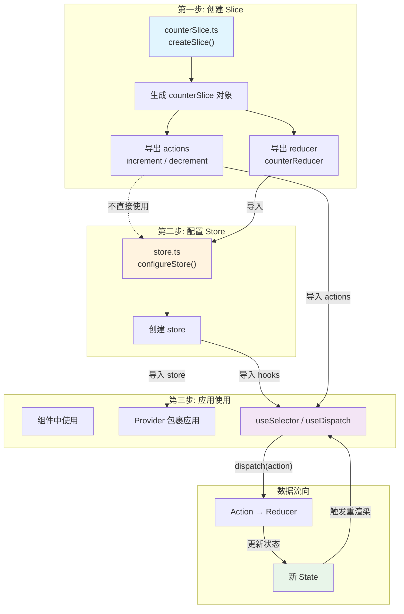

# Redux Toolkit 入门案例

> 基于 Redux Toolkit + TypeScript + React 的计数器应用

## 一、项目概述

这是一个完整的 Redux Toolkit 入门案例，实现了一个简单的计数器功能，包含：
- 递增/递减操作
- 指定数量递增
- 完整的 TypeScript 类型支持
- React-Redux 集成

## 二、依赖安装

```json
{
  "dependencies": {
    "@reduxjs/toolkit": "^2.6.0",
    "react": "^19.0.0",
    "react-dom": "^19.0.0",
    "react-redux": "^9.2.0"
  }
}
```

## 三、项目结构

```
ts-version/
├── src/
│   ├── features/
│   │   └── counterSlice.ts      # Counter Slice（状态+reducer+actions）
│   ├── store.ts                  # Store 配置
│   ├── hooks.ts                  # 类型化的 hooks
│   ├── main.tsx                  # 应用入口（Provider 包裹）
│   ├── App.tsx                   # 主组件
│   ├── App.module.css            # 样式
│   └── 工作原理.mermaid           # 工作原理图
├── package.json
├── tsconfig.json
└── vite.config.ts
```

## 四、核心文件详解

### 1. 创建 Slice - features/counterSlice.ts

```typescript
import { createSlice, PayloadAction } from '@reduxjs/toolkit';

// 定义状态类型
interface CounterState {
  value: number;
}

const initialState: CounterState = {
  value: 0,
};

// 创建 Slice
export const counterSlice = createSlice({
  name: 'counter',           // slice 名称，用于生成 action type
  initialState,              // 初始状态
  reducers: {                // reducer 函数
    increment: (state) => {
      state.value += 1;      // Immer 允许直接修改
    },
    decrement: (state) => {
      state.value -= 1;
    },
    incrementByAmount: (state, action: PayloadAction<number>) => {
      state.value += action.payload;
    },
  },
});

// 导出 action creators（自动生成）
export const { increment, decrement, incrementByAmount } = counterSlice.actions;

// 导出 reducer
export default counterSlice.reducer;
```

**关键点：**
- `createSlice` 自动生成 action creators 和 action types
- `PayloadAction<T>` 为 action payload 提供类型
- Immer 允许直接修改 state（不是必需的）

### 2. 配置 Store - store.ts

```typescript
import { configureStore } from '@reduxjs/toolkit';
import counterReducer from './features/counterSlice';

// 配置 store
export const store = configureStore({
  reducer: {
    counter: counterReducer,  // 键名对应 state 中的属性名
  },
});

// 推断类型
export type RootState = ReturnType<typeof store.getState>;
export type AppDispatch = typeof store.dispatch;
```

**关键点：**
- `configureStore` 自动配置 Redux DevTools、中间件
- 从 store 本身推断 `RootState` 和 `AppDispatch` 类型

### 3. 类型化 Hooks - hooks.ts

```typescript
import { useDispatch, useSelector } from 'react-redux';
import type { RootState, AppDispatch } from './store';

// 导出类型化的 hooks
export const useAppDispatch = useDispatch.withTypes<AppDispatch>();
export const useAppSelector = useSelector.withTypes<RootState>();
```

**关键点：**
- 使用 `.withTypes<T>()` 为 hooks 添加类型推断
- 推荐在应用中使用这些类型化 hooks

### 4. 应用入口 - main.tsx

```typescript
import { StrictMode } from 'react';
import { createRoot } from 'react-dom/client';
import { Provider } from 'react-redux';
import { store } from './store.ts';
import App from './App.tsx';

createRoot(document.getElementById('root')!).render(
  <StrictMode>
    <Provider store={store}>
      <App />
    </Provider>
  </StrictMode>
);
```

**关键点：**
- 使用 `<Provider>` 包裹应用，传入 store
- 使所有组件都能访问 Redux store

### 5. 组件使用 - App.tsx

```typescript
import { decrement, increment, incrementByAmount } from './features/counterSlice';
import { useAppDispatch, useAppSelector } from './hooks';
import { useState } from 'react';

function App() {
  // 读取状态
  const count = useAppSelector((state) => state.counter.value);

  // 获取 dispatch 函数
  const dispatch = useAppDispatch();

  const [input, setInput] = useState<number>(0);

  function handleIncrementByAmount() {
    setInput(0);
    dispatch(incrementByAmount(input));  // dispatch action
  }

  return (
    <main>
      <h1>Redux Toolkit with TS</h1>
      <section>
        <button onClick={() => dispatch(decrement())}>-</button>
        <p>{count}</p>
        <button onClick={() => dispatch(increment())}>+</button>
      </section>

      <section>
        <input value={input} onChange={(e) => setInput(+e.target.value)} />
        <button onClick={handleIncrementByAmount}>Add by {input}</button>
      </section>
    </main>
  );
}
```

**关键点：**
- `useAppSelector` 读取状态（自动类型推断）
- `useAppDispatch` 获取 dispatch 函数
- 直接调用 action creator 函数来 dispatch

## 五、工作原理图



## 六、数据流

1. **用户交互** → 点击按钮
2. **Dispatch Action** → `dispatch(increment())`
3. **Reducer 处理** → `counterReducer` 更新 state
4. **Store 更新** → 生成新的 state
5. **组件重渲染** → `useAppSelector` 检测到变化

## 七、关键概念总结

| 概念 | 说明 | 文件位置 |
|------|------|----------|
| **Slice** | 状态 + reducer + actions 的集合 | `features/counterSlice.ts` |
| **Store** | 保存应用状态的对象 | `store.ts` |
| **Reducer** | 纯函数，根据 action 更新状态 | Slice 内部 |
| **Action** | 描述状态变化的对象 | 自动生成 |
| **Provider** | 使 store 对组件可用 | `main.tsx` |
| **useSelector** | 从 store 读取状态 | `App.tsx` |
| **useDispatch** | dispatch actions | `App.tsx` |

## 八、运行项目

```bash
# 安装依赖
npm install

# 启动开发服务器
npm run dev

# 构建生产版本
npm run build
```
