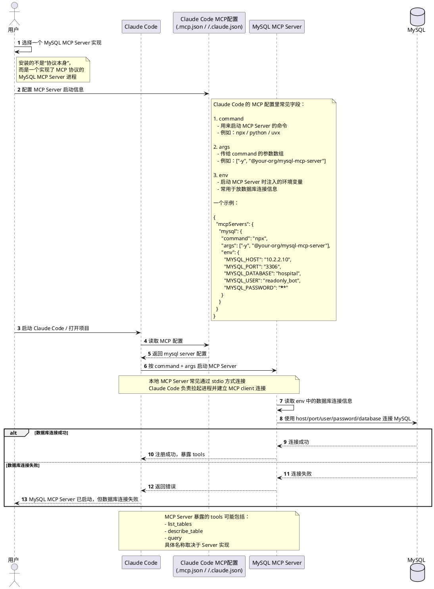
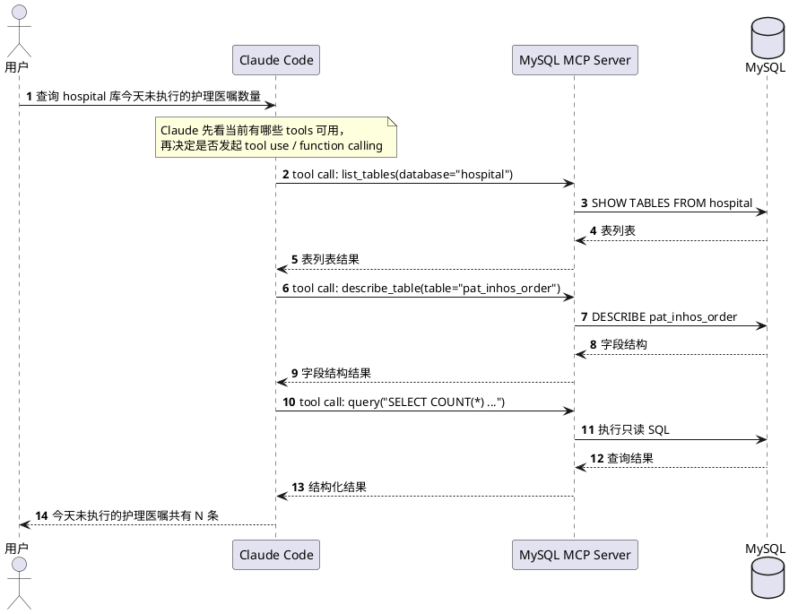

# 重点

[飞天闪客 - 一口气拆穿 Skill / MCP / RAG / Agent / OpenClaw 底层逻辑](https://www.bilibili.com/video/BV1ojfDBSEPv/?spm_id_from=333.337.search-card.all.click&vd_source=401e9151ff5196d99069159680a48dbc)
	
## 1. LLM 大语言模型

## 2. Prompt 提示词

## 3. Context 上下文

## 4. Memory 记忆

## 5. Agent 智能体
 
## 6. RAG 检索增强生成

## 7. Search 搜索

![[Pasted image 20260403212858.png|L|800]]

## 8. Tools 工具

指 Agent 或大模型可调用的外部能力，比如搜索、计算、文件操作、数据库查询、API 调用等。`Tools` 解决的是“有哪些能力可以用”，而 `Function Calling` 解决的是“模型如何把这些能力调用起来”。

![[Pasted image 20260403211538.png|L|800]]

Agent 如何发现并调用这些工具？就又需要一套约定的规范了，约定好 tools/list 就是返回工具列表，tools/call 就是调用具体的工具，这里的约定也起了个名字叫做 **MCP**，翻译过来就是**模型上下文协议**。

![[Pasted image 20260403212518.png|L|800]]

## 9. Function Calling

可以，把 **Function Calling** 理解成：

> 让大模型在需要时，按约定格式“请求调用外部函数/工具”的机制。

它不是模型自己真的去执行代码，而是：

1.	模型判断：当前问题是否需要调用某个工具
2.	模型产出：一个结构化的“函数调用请求”
3.	Agent 执行：真正去调用后端函数 / API / 数据库 / 搜索工具
4.	把结果回传给模型
5.	模型再基于结果生成最终回答

### 1. 为什么会有 Function Calling

普通聊天模型只会“生成文本”。

例如你问：

>“帮我查一下北京今天天气”

如果只是纯文本模型，它可能会“猜”一个天气。
但真实场景里，天气应该来自 天气 API，不是模型瞎编。

所以就需要一种机制，让模型在合适的时候说：

>“这事我该调用 get_weather(city=北京) 这个函数。”

这就是 Function Calling 的核心价值：

•	让模型能连接外部世界
•	让回答基于真实数据
•	让输出参数结构化，方便 Agent 处理
•	适合做 Agent、助手、自动化流程

### 2.  它到底是什么

Function Calling 本质上是：

> 你先告诉模型：我这里有哪些函数可用，每个函数需要什么参数。

然后模型在对话过程中，可能会返回类似这样的内容：

```json
{
  "name": "get_weather",
  "arguments": {
    "city": "北京"
  }
}
```

注意：这不是函数已经执行了。

这只是模型在说：

> “我建议调用这个函数，并且参数是这些。”

真正执行的是你的 Agent，不是模型本身。

### 3. 一个完整的流程

比如你有一个函数：

```python
def get_weather(city: str) -> str:
    return "北京今天晴，18~26°C"
```

用户问：

北京今天天气怎么样？

流程如下：

**第一步：把函数描述告诉模型**

你告诉模型：
	•	有个函数叫 get_weather
	•	参数是 city
	•	用来查询天气

**第二步：模型决定调用函数**

模型返回：

```json
{
  "name": "get_weather",
  "arguments": {
    "city": "北京"
  }
}
```

**第三步：Agent 收到这个请求后，真正执行函数**

```python
result = get_weather("北京")
```

得到：

```text
北京今天晴，18~26°C
```

**第四步：把函数结果再发给模型**

你把结果告诉模型：

>工具调用结果：北京今天晴，18~26°C

**第五步：模型组织成自然语言回复用户**

最后模型输出：

>北京今天天气晴，气温大约 18 到 26 摄氏度。

### 4. 一句话总结

> **Function Calling 就是：让大模型用结构化方式“申请调用工具”，再由外部程序真正执行，并把结果返回给模型继续回答。**


## 10. MCP

![[Pasted image 20260321005753.png|L|800]]

## 11. LangChain

![[Pasted image 20260321010534.png|L|800]]

## 12. Workflow（工作流）

为了应对非程序员场景，可通过低代码平台以简单拖拽的方式搭建工作流，实现任务编排。

![[Pasted image 20260321010720.png|L|800]]

## 13. Skill

![[Pasted image 20260321010916.png|L|800]]

![[Pasted image 20260321011008.png|L|800]]

## 14. SubAgent

![[Pasted image 20260321011057.png|L|800]]

# 易混淆 1：Function Calling 与 MCP 的区别

### Function Calling 的关注点

它关注的是：

> **“这一轮对话里，模型该怎么表达一次工具调用意图？”**

也就是偏 **推理时的调用动作**。

模型会产出类似：

```json
{
  "name": "get_weather",
  "arguments": {
    "city": "Beijing"
  }
}
```

然后由应用侧执行。

### MCP 的关注点

它关注的是：

> **“外部工具/数据源，如何以统一协议接入，让不同 AI 客户端都能用？”**

也就是偏 **系统集成 / 接口标准化**。

MCP 不只是“调用函数”，还定义了：

- 怎么列出工具
- 怎么暴露资源
- 怎么提供 prompt 模板
- 客户端和 server 怎么通信

官方把它描述成连接 AI 应用与外部系统的开放标准。

### 一个更精准的分层图

```text
用户
  ↓
Agent / LLM
  ↓  （决定要不要调工具：Function Calling / Tool Calling）
工具调用层
  ↓
工具接入层
  ├─ 本地函数
  ├─ 内置工具
  ├─ 第三方 API
  └─ MCP Server <--- 在此 Agent 作为 client 去发现这些能力
        ├─ Tools
        ├─ Resources
        └─ Prompts
```

- **Function Calling** 在“工具调用层”
- **MCP** 在“工具接入层/协议层”

### 案例 - Claude Code MCP

#### 安装 / 接入准备阶段
 

#### 运行时调用阶段




# 易混淆 2：Skill 与 MCP 的区别


# 总结

![[Pasted image 20260321011231.png|L|400]]
