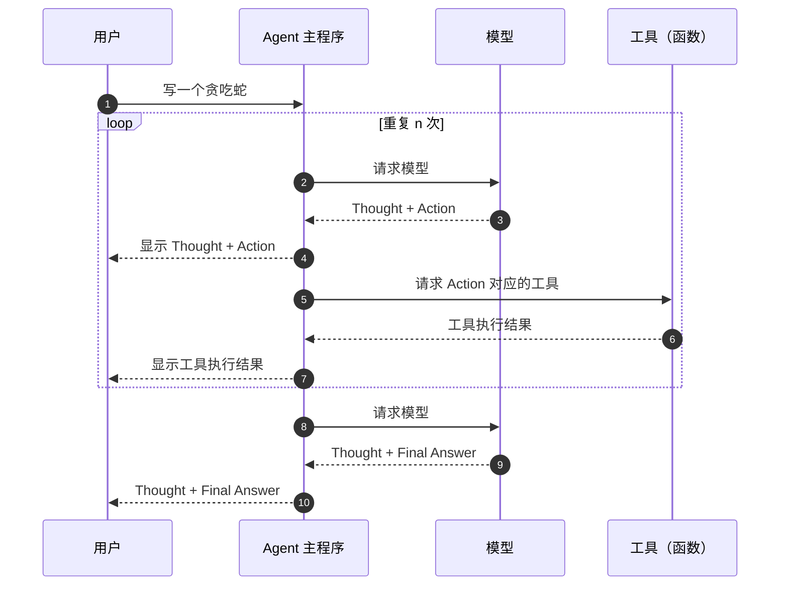
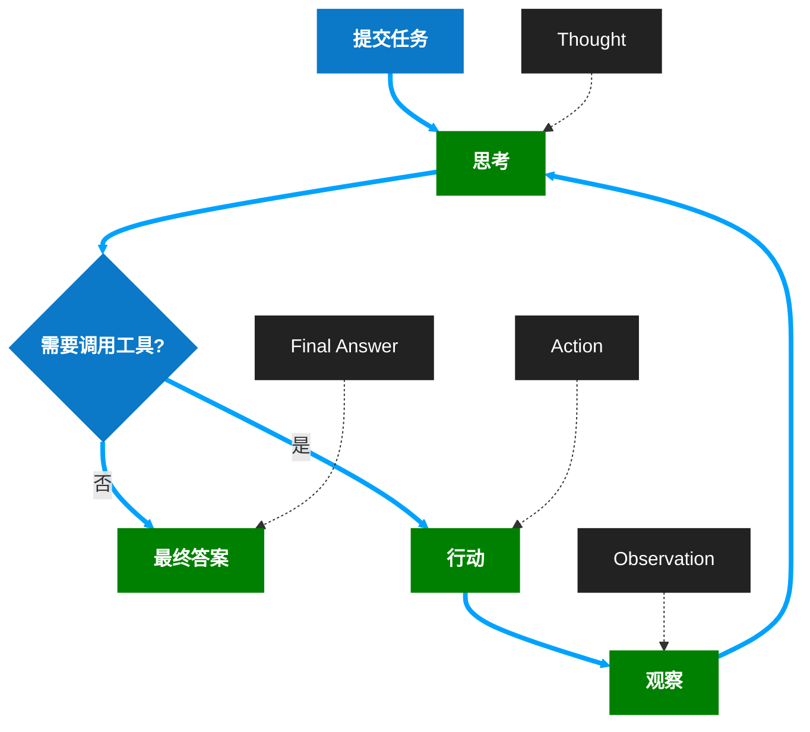
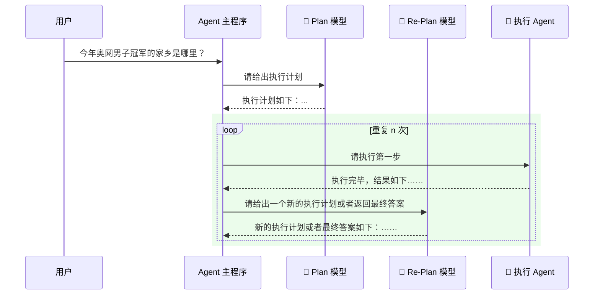

* [Agent 的概念、原理与构建模式 —— 从零打造一个简化版的 Claude Code](https://www.bilibili.com/video/BV1TSg7zuEqR/?spm_id_from=333.337.search-card.all.click&vd_source=401e9151ff5196d99069159680a48dbc)

# ReAct

>Reasoning and Action

## 时许图

## 流程图

- **提交任务**：接收用户的初始请求。
- **思考（Thought）**：对任务进行分析、推理，判断是否需要借助外部工具来完成。
- **判断是否需要调用工具**：
    - **是**：执行**行动（Action）**，调用对应的工具（如搜索、计算等）。
    - **否**：直接生成**最终答案（Final Answer）**，结束流程。
- **观察（Observation）**：获取工具返回的结果，并将其反馈给**思考**环节，继续迭代推理，直到可以给出最终答案。

# Plan-and-Execute

![[Pasted image 20260323072539.png|L|800]]

## 时序图

- **用户提问**：向 Agent 主程序发起问题查询。
- **初始规划**：主程序请求 Plan 模型生成第一步执行计划。
- **迭代执行与重规划**：
    - 主程序将计划步骤交给执行 Agent 执行。
    - 执行完成后，主程序请求 Re-Plan 模型根据当前结果更新后续计划。
    - 循环执行直到问题解决。
- **最终输出**：循环结束后，主程序汇总结果并返回给用户。

# 区别

最核心区别在于：**ReAct 是边想边做，Plan+RePlan 是先规划、再执行、再重规划。**

