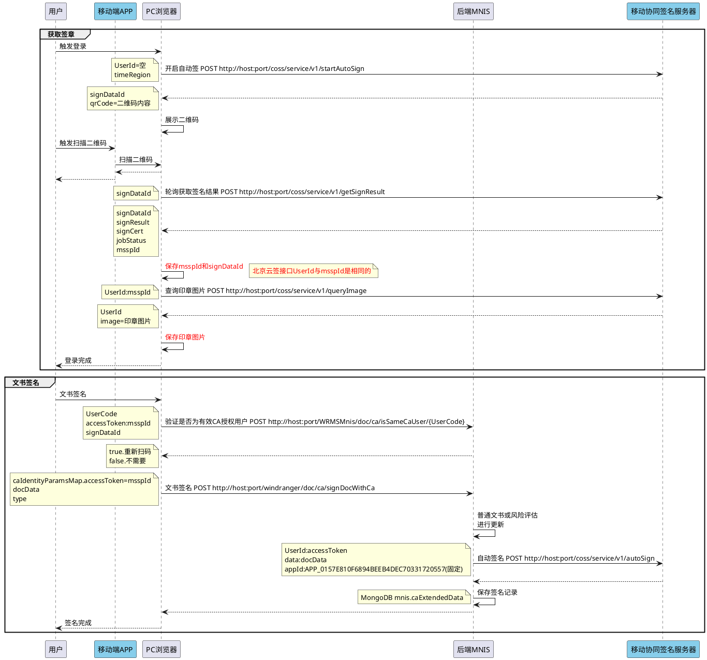

# 北京云签

```plantuml
@startuml 北京云CA
' !theme cerulean-outline
' !theme plain

skinparam defaultFontName "Cascadia Mono"

participant 用户 as User
participant 移动端APP as App #skyblue
' participant 移动端SDK as ClientSDK #skyblue
participant PC浏览器 as PC
participant 后端MNIS as MNIS
participant 移动协同签名服务器 as BeiJingCA #skyblue

group 获取签章
    User -> PC: 触发登录

    PC -> BeiJingCA: 开启自动签 POST http://host:port/coss/service/v1/startAutoSign
    note left: UserId=空\ntimeRegion
    BeiJingCA --> PC:
    note left: signDataId\nqrCode=二维码内容

    PC -> PC: 展示二维码

    User -> App: 触发扫描二维码
    App -> PC: 扫描二维码
    PC --> App:
    App --> User: 

    ' App -> ClientSDK: 调用扫码签名接口
    ' ClientSDK --> App: 签名成功
    ' note right: 中间的交互过程省略

    PC -> BeiJingCA: 轮询获取签名结果 POST http://host:port/coss/service/v1/getSignResult
    note left: signDataId
    BeiJingCA --> PC: 
    note left: signDataId\nsignResult\nsignCert\njobStatus\nmsspId

    PC -> PC: <font color=red>保存msspId和signDataId</font>
    note right: <font color=red>北京云签接口UserId与msspId是相同的</font>

    PC -> BeiJingCA: 查询印章图片 POST http://host:port/coss/service/v1/queryImage
    note left: UserId:msspId
    BeiJingCA --> PC: 
    note left: UserId\nimage=印章图片

    PC -> PC: <font color=red>保存印章图片</font>

    PC --> User: 登录完成
end


group 文书签名
    User -> PC: 文书签名

    PC -> MNIS: 验证是否为有效CA授权用户 POST http://host:port/WRMSMnis/doc/ca/isSameCaUser/{UserCode}
    note left: UserCode\naccessToken:msspId\nsignDataId
    MNIS --> PC: 
    note left: true.重新扫码\nfalse.不需要

    PC -> MNIS: 文书签名 POST http://host:port/windranger/doc/ca/signDocWithCa
    note left: caIdentityParamsMap.accessToken=msspId\ndocData\ntype

    MNIS -> MNIS: 普通文书或风险评估\n进行更新

    MNIS -> BeiJingCA: 自动签名 POST http://host:port/coss/service/v1/autoSign
    note left: UserId:accessToken\ndata:docData\nappId:APP_0157E810F6894BEEB4DEC70331720557(固定)

    BeiJingCA --> MNIS:

    MNIS -> MNIS: 保存签名记录
    note left: MongoDB mnis.caExtendedData

    MNIS --> PC
    PC --> User: 签名完成
end
@enduml
```