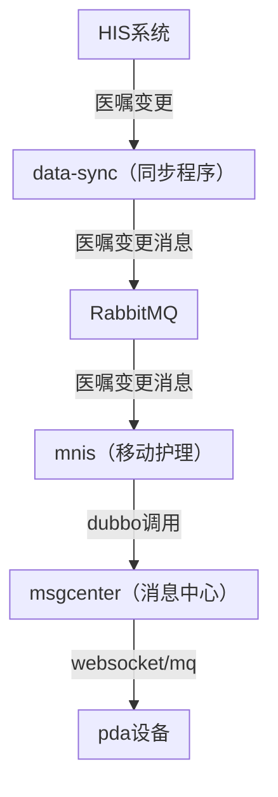

# 整体流程




说明：

* 同步程序：对应可能是新同步程序，也可能是旧同步程序，需要自行确认
* 同步程序发送医嘱变更消息：RabbitMQ#exchange=sync_data_pat_inhos_order_exchange
* 移动护理消费医嘱变更消息：RabbitMQ#queue=QUEUE_MNIS_PAT_INHOS_ORDER
* 移动护理：
	* 后端服务：springboot_mnis
	* 服务路径：/usr/local/springboot/springbootX_mnis
* 消息中心：
	* 后端服务：springboot_msgcenter
	* 服务路径：/usr/local/springboot/springbootY_msgcenter

# 详细步骤

## 1. 医嘱变更消息推送 - 同步程序

> 提醒的前提：同步程序推送医嘱变更消息至队列：`sync_data_pat_inhos_order_exchange`

如何确认有没有推送到移动护理？见下面[[04.医嘱管理_06.新医嘱&停嘱提醒#2.医嘱变更消息推送-移动护理]]

具体推送有没有找对应同事确认。


## 2. 医嘱变更消息推送 - 移动护理

> 移动护理消费消息入口：`com.lachesis.windranger.mnis.listener.mq.PatInhosOrderListener#listenVitalSingQueue`

### 接收到的日志样例

```bash
# 3699579551：原始医嘱pat_inhos_order表的order_code字段
# log-info-2026-03-02.*.log：对应推送的日志文件（新医嘱提醒，需要确认原始医嘱pat_inhos_order表的create_time时间，才能确定对应的日志文件）
[root@lianxin-huli-yingyong info]# grep "3699579551" log-info-2026-03-02.*.log
log-info-2026-03-02.10.log:2026-03-02 08:51:59.121 mnis [SimpleAsyncTaskExecutor-1] INFO  c.l.w.mnis.listener.mq.PatInhosOrderListener - <0><mnis:a4cc1daccae24f498c5a1ae67cf2dc2d> 新增医嘱消息处理开始:insertSize=1,insertList=["3699579551"]
log-info-2026-03-02.10.log:2026-03-02 08:51:59.138 mnis [SimpleAsyncTaskExecutor-1] INFO  c.l.w.mnis.listener.mq.PatInhosOrderListener - <0><mnis:72f201e0d88a4cf3b4812b68a43244c4> 更新医嘱消息处理开始:updateSize=1,updateList=["3699579551"]
log-info-2026-03-02.10.log:2026-03-02 08:55:24.783 mnis [SimpleAsyncTaskExecutor-1] INFO  c.l.w.mnis.listener.mq.PatInhosOrderListener - <0><mnis:b10c1f5f5fe94020855880653342e58a> 新增医嘱消息处理开始:insertSize=1,insertList=["3699579551"]
```


## 3. 原始医嘱过滤 - 移动护理

### 3.1 新医嘱过滤

> 只会处理**新增**的原始医嘱数据（即insertList中的医嘱消息）
>
> 过滤逻辑：`com.lachesis.windranger.mnis.listener.mq.PatInhosOrderListener#getNewOrderCodes`方法

#### 过滤规则

**1. 原始医嘱表字段必须存在：**

- `orderingDept`（开立病区，`pat_inhos_order`表的`ordering_dept`）
- `inhosCode`（住院号，`pat_inhos_order`表的`inhos_code`）
- `orderStatus`（原始医嘱状态，`pat_inhos_order`表的`order_status`）
- `enterDateTime`（开立时间，`pat_inhos_order`表的`enter_date_time`）

> 以上任一字段为空则过滤掉

**2. 原始医嘱状态过滤（排除无效状态）：**

排除以下医嘱状态：

- `ORDER_STATUS_PRE_STOP`（预停止，`pat_inhos_order`表的`order_status`=5）
- `ORDER_STATUS_CANCEL`（作废，`pat_inhos_order`表的`order_status`=4）
- `ORDER_STATUS_STOP`（停止，`pat_inhos_order`表的`order_status`=3）

> 新医嘱提醒不会推送已停止、已作废或预停止状态的医嘱

**3. 时间范围过滤：**

```
当前时间-1天 < 开立时间 < 当前时间
```

具体逻辑：

- `enterDateTime >= before24Hour`：开立时间不能早于24小时前
- `enterDateTime < now`：开立时间不能晚于当前时间

> 超出24小时的医嘱不会被推送（避免历史医嘱重复提醒）

#### 关键日志

```java
log.info("新医嘱筛选后:invalidSize={},invalidStatusSize={},timeOutOfRangeSize={},size={}", invalidSize, invalidStatusSize, timeOutOfRangeSize, size(result));
```

**参数说明：**

| 参数                     | 说明                                                              |
| ---------------------- | --------------------------------------------------------------- |
| **invalidSize**        | 必填字段缺失的数量（orderingDept/inhosCode/orderStatus/enterDateTime任一为空） |
| **invalidStatusSize**  | 医嘱状态无效的数量（状态为停止/作废/预停止）                                         |
| **timeOutOfRangeSize** | 时间范围外的数量（开立时间早于24小时前或晚于当前时间）                                    |
| **size**               | 最终通过筛选的医嘱数量                                                     |

#### 日志示例

```log
2025-08-25 10:41:45.696 mnis [...] INFO  c.l.w.mnis.listener.mq.PatInhosOrderListener - 新医嘱筛选前:size=1
2025-08-25 10:41:45.696 mnis [...] INFO  c.l.w.mnis.listener.mq.PatInhosOrderListener - 新医嘱筛选后:invalidSize=0,invalidStatusSize=0,timeOutOfRangeSize=0,size=1
```

#### Arthas调试

也可借助Arthas工具查看过滤后的结果：

```bash
$ watch com.lachesis.windranger.mnis.listener.mq.PatInhosOrderListener getNewOrderCodes '{params,returnObj,throwExp}' -n 5 -x 3
```


### 3.2 停医嘱过滤

> 只会处理**更新**的原始医嘱数据（即updateList中的医嘱消息）

#### 过滤逻辑

**1. 缓存检查**

首先会检查是否已经发送过，发送过会缓存。下面的日志：剔除前是1，剔除后是0，说明已经发送过了

- ![[Pasted image 20251203092655.png|L|800]]
- [[04.医嘱管理_06.新医嘱&停嘱提醒#过程#如何检查已经缓存并清除发送过的缓存？]]

**2. 停医嘱过滤规则**

1. 原始医嘱表字段必须存在：
   - `orderingDept` = 开立病区
   - `inhosCode` = 住院号
   - `orderStatus` = 原始医嘱状态

2. `orderStatus = 3` 或者 `当前时间-1天 < stopDateTime < 当前时间`

#### Arthas调试

```bash
$ watch com.lachesis.windranger.mnis.listener.mq.PatInhosOrderListener getStopOrders '{params,returnObj,throwExp}' -n 5 -x 3
```

#### 如何检查已经缓存并清除发送过的缓存？

```bash
# 使用Redis提供的工具（直接在移动护理所在的应用服务器上执行）
$ redis-cli
> auth lx_1234
127.0.0.1:6379> ZSCORE STOP_ORDER_HIS_KEY '24384338'  # 24384338是原始医嘱的orderCode字段
"1764666291221"
127.0.0.1:6379> ZREM STOP_ORDER_HIS_KEY '24384338'     # 清除缓存
(integer) 1
127.0.0.1:6379> ZSCORE STOP_ORDER_HIS_KEY '24384338'
(nil)
```


## 4. 配置检查 - 配置中心

新医嘱开关必须开启：**业务配置 -> 移动护理 -> 医嘱提醒配置 -> 新医嘱推送**

![[Pasted image 20250821152905.png|L|1000]]

## 5. 推送提醒用户 - 移动护理

### 如何查看推送医护人员？

在移动护理后端应用所在服务器上执行如下命令：

```bash
# 使用Redis提供的工具（直接在移动护理所在的应用服务器上执行）
$ redis-cli
> auth lx_1234
> get WARD_CACHE_KEY:{wardCode}  # 记得替换患者病区，看看有没有要推送给医护人员的userCode
```

> [!danger] 推送的医护人员userCode必须满足的条件：对应windranger_hospital.hos_user表数据的user_type必须是01或者02其中一个

如果不是，在数据库中改完数据之后，清空缓存：

```bash
> del WARD_CACHE_KEY:{wardCode}  # 清空缓存
```

然后，需要**重新触发同步程序推送医嘱变更消息**。

> [!danger] 如何确认消息发送给消息中心？

```bash
watch com.lachesis.molecule.msgcenter.api.ICenterMsgApi sendWithUsersAndWard '{params,returnObj,throwExp}' -n 5 -x 3
```


## 6. 消息中心推送至PDA - 消息中心

```bash
# 具体这里的Y是几安装系统而异，正常都是一个数字，是几不重要
$ cd /usr/local/springboot/springbootY_msgcenter/MsgCenter/LOGS
# 999903546234991对应原始医嘱的orderGroupNo
# 123对应发送给哪个医护人员
$ grep "999903546234991" log_info.log | grep "消息发送成功" | grep "123"
```

### 发送成功日志示例

```log
08/21 15:58:53.346 [DubboServerHandler-10.2.3.170:20583-thread-193] INFO  c.l.m.msgcenter.service.impl.MnisMessageService - 消息发送成功，userCode:123，wardCode:310,msgJson：{"msg":{"bedCode":"104免f","orderGroupNo":"999903546234991","overtime":0,"patName":"谢玉家3335","time":1755763133,"title":"新医嘱提醒","inhosCode":"93295451"},"msgType":"new_order_type","recordId":"new_order_999903546234991","time":1755763133}
```


![[img_v3_02vn_0596b71a-eb1c-4dea-8b0b-4401b715c83g 1.jpg|L|1400]]


## 7. PDA处理接收到的消息 - PDA设备

推送给PDA之后，PDA提示不提示，还有对应的流程，需要PDA端同事补充逻辑

**如果没有收到？会是哪些原因呢？**

原因1：没分组

![[img_v3_02vo_6d642027-7c89-48a9-bbf3-5d484ef6294g.jpg|L|1200]]


![[img_v3_02vo_b780180e-b7e1-4318-9242-c9233083686g.jpg|L|400]]


> TODO补充 @刘泽霖


# 手动补偿重新触发医嘱变更消息推送

## 接口

接口：`/WRMSMnis/mnis/testNewOrder`

### 请求参数

```json
{
  "insertList": [
    "9999251247834991"
  ],
  "updateList": [
    "1014800919",
    "1015214029",
    "1015182605",
    "1013666491",
    "1015182705",
    "1013666492",
    "1014800920",
    "1013666493",
    "1015384805",
    "1015438755",
    "1013666489",
    "1014767002",
    "1015438753",
    "1015214031",
    "1015214032"
  ]
}
```

**参数说明：**

- 新医嘱提醒就将orderCode放置在`insertList`中
- 停医嘱提醒就将orderCode放置在`updateList`中

---

## 新医嘱提醒相关日志

> 通过traceId就可以串起来查询整个链路！

### from mnis

```log
2025-08-25 10:41:45.683 mnis [http-nio-9099-exec-5] INFO  c.l.w.mnis.listener.mq.PatInhosOrderListener - <0><43c6f65f4aa146a3923cb4222c6b9f0c> 新增医嘱消息处理开始:insertSize=1,insertList=["9999251247834991"]
2025-08-25 10:41:45.696 mnis [http-nio-9099-exec-5] INFO  c.l.w.mnis.listener.mq.PatInhosOrderListener - <0><43c6f65f4aa146a3923cb4222c6b9f0c> 新医嘱筛选前:size=1
2025-08-25 10:41:45.696 mnis [http-nio-9099-exec-5] INFO  c.l.w.mnis.listener.mq.PatInhosOrderListener - <0><43c6f65f4aa146a3923cb4222c6b9f0c> 新医嘱筛选后:invalidSize=0,invalidStatusSize=0,timeOutOfRangeSize=0,size=1
2025-08-25 10:41:45.696 mnis [http-nio-9099-exec-5] INFO  c.l.windranger.mnis.service.impl.PushMsgService - <0><43c6f65f4aa146a3923cb4222c6b9f0c> 推送服务开始处理医嘱消息:messageTitle=新医嘱提醒,orderSize=1
2025-08-25 10:41:45.760 mnis [http-nio-9099-exec-5] INFO  c.l.windranger.mnis.service.impl.PushMsgService - <0><43c6f65f4aa146a3923cb4222c6b9f0c> 推送消息:wardCode=310,inhosCode=93295451,orderGroupNo=999903546234991
2025-08-25 10:41:47.191 mnis [http-nio-9099-exec-5] INFO  c.l.windranger.mnis.service.impl.PushMsgService - <0><43c6f65f4aa146a3923cb4222c6b9f0c> 消息推送完成:successSize=1,stOrderSize=0
```

### from msgcenter

```log
2025-08-25 10:41:46.427 msgcenter [DubboServerHandler-10.2.43.39:20583-thread-11] INFO  c.l.m.msgcenter.service.impl.MnisMessageService - <0.4><43c6f65f4aa146a3923cb4222c6b9f0c> 用户不在线缓存消息:{"forceCache":2,"mnisMsgVo":{"msg":{"bedCode":"104免f","orderGroupNo":"999903546234991","overtime":0,"patName":"谢玉家3335","time":1756089705,"title":"新医嘱提醒","inhosCode":"93295451"},"msgType":"new_order_type","recordId":"new_order_999903546234991","time":1756089705},"userCodes":["9999","123","8097"],"wardCode":"310"}
2025-08-25 10:41:46.957 msgcenter [DubboServerHandler-10.2.43.39:20583-thread-11] INFO  c.l.m.msgcenter.service.impl.MnisMessageService - <0.4><43c6f65f4aa146a3923cb4222c6b9f0c> 删除缓存消息:recordId=new_order_999903546234991,msgType=new_order_type,deletedCount=640
2025-08-25 10:41:47.149 msgcenter [DubboServerHandler-10.2.43.39:20583-thread-11] INFO  c.l.m.msgcenter.service.impl.MnisMessageService - <0.4><43c6f65f4aa146a3923cb4222c6b9f0c> 消息处理完成:consume=1273ms
```

![[Pasted image 20250825104318.png|L|400]]

---

# 问题定位

## 如何快速定位停止医嘱问题？

1. **找traceId**：找到目标原始医嘱的orderCode字段，直接去搜日志，找到对应的traceId
2. **根据traceId查看日志链路**：看日志走在哪个节点了？
3. **再根据具体情况具体分析**

## 案例

- [[04.医嘱管理_06.新医嘱&停嘱提醒_新医嘱问题案例]]
