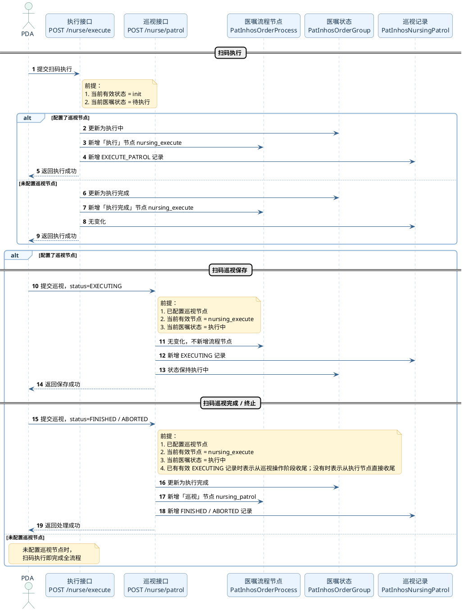
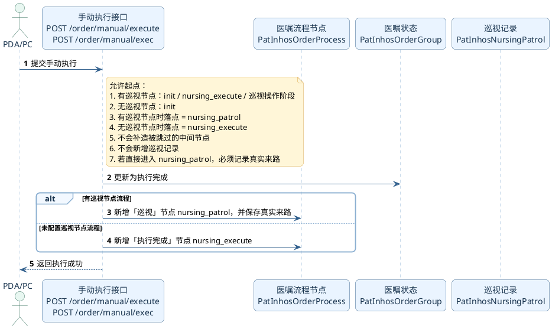
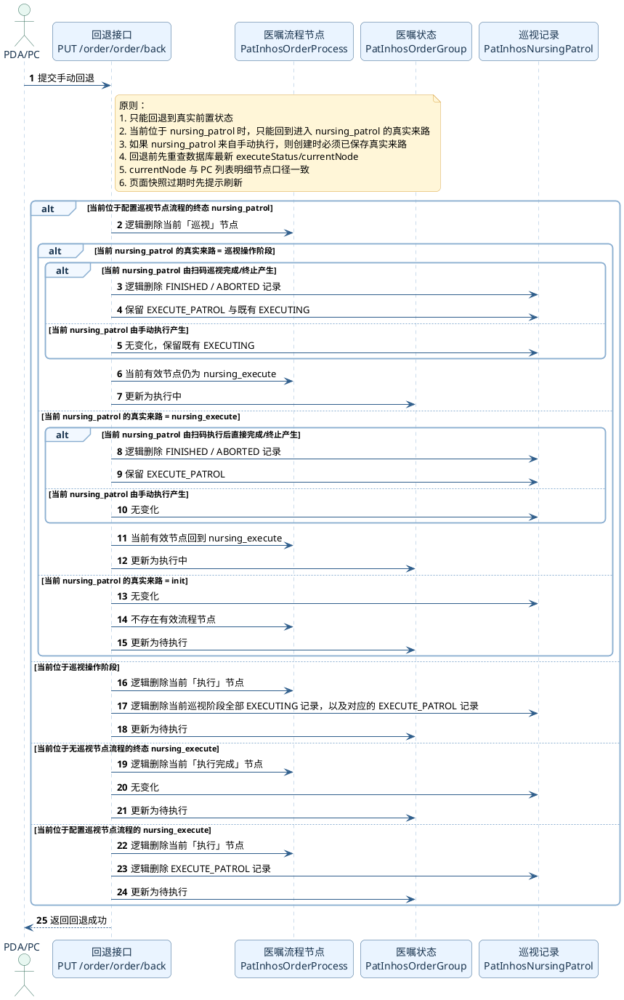

# 护理治疗

## 医嘱类型定义

`processType = nursing_care`

### 如何根据原始医嘱判断是护理治疗

TODO

# 护理治疗(审核)

## 医嘱类型定义

`processType = nursing_care_check`

### 如何根据原始医嘱判断是护理治疗(审核)

TODO

# 护理治疗(巡视)

## 医嘱类型定义

`processType = nursing_care_patrol`

### 如何根据原始医嘱判断是护理治疗(巡视)

大类是护理医嘱 `nursingOrder`，子类别固定是 `nursing_care_patrol`

![[Pasted image 20260402165958.png|L|1200]]

对应原始医嘱上的类别字段：

```SQL
select order_group_no,order_class_code from windranger_emr.pat_inhos_order where order_group_no = '834336542';
```

| order\_group\_no | order\_class\_code |
| :--- | :--- |
| 834336542 | nursing\_care\_patrol |
| 834336542 | nursing\_care\_patrol |


## 流程节点定义

```java
/**
 * 护理治疗执行
 */
String NURSING_EXECUTE = "nursing_execute";
/**
 * 护理治疗巡视
 */
String NURSING_PATROL = "nursing_patrol";
```

底层存储：

```js
{
    "processType": "nursing_care_patrol",
    "processName": "护理治疗(巡视)",
    "sortNo": 11,
    "processNodes": [
      {
        "nodeKey" : "nursing_execute",
        "nodeName" : "护理治疗执行",
        "displayName" : "护理治疗执行",
        "doubleCheck" : false,
        "remindOpen" : false,
        "personCheck" : false,
        "color" : "#1cf8a3",
        "syncUpdateNodeEndColor" : true
      },
        {
            "nodeKey": "nursing_patrol",
            "nodeName": "巡视",
          "displayName" : "巡视",
            "doubleCheck": false,
            "remindOpen": false,
            "personCheck": false,
            "color": "#1cf8a3",
            "syncUpdateNodeEndColor": false
        }
    ],
  "current" : true,
  "_class" : "com.lachesis.windranger.mnis.dbmodel.order.OrderProcessTpl"
}
```

## 巡视状态定义

```java
/**
 * 护理治疗巡视状态
 */
interface NursePatrolStatus {
    String NURSING_PATROL_STATUS_EXECUTE_PATROL = "EXECUTE_PATROL"; // 护理治疗执行时-巡视
    String NURSING_PATROL_STATUS_EXECUTING = "EXECUTING"; // 护理治疗巡视-执行中
    String NURSING_PATROL_STATUS_FINISHED = "FINISHED"; // 护理治疗巡视-完成
    String NURSING_PATROL_STATUS_ABORTED = "ABORTED"; // 护理治疗巡视-终止
}
```

## 状态流转规则

### 先理解 3 层状态

- 流程节点（`PatInhosOrderProcess`）
  - 描述当前流程走到了哪个阶段
  - 配置了巡视节点：`init -> nursing_execute -> nursing_patrol`
  - 未配置巡视节点：`init -> nursing_execute`
  - 其中 `init` 只是概念上的起点，不是实际存在的流程节点
- 医嘱状态（`PatInhosOrderGroup`）
  - 描述医嘱当前处于“待执行 / 执行中 / 执行完成”中的哪一种业务状态
- 巡视记录状态（`PatInhosNursingPatrol`）
  - 仅适用于配置了巡视节点的流程
  - 描述扫码执行、扫码巡视、扫码巡视完成/终止产生的巡视记录
  - `EXECUTE_PATROL`：扫码进入“执行”阶段时产生
  - `EXECUTING`：每次扫码巡视时产生；每巡视一次新增一条
  - `FINISHED` / `ABORTED`：扫码巡视完成/终止时产生；可在执行后直接提交，也可在已有巡视记录后提交
  - 未配置巡视节点时，不会产生任何 `PatInhosNursingPatrol` 记录
  - 手动执行只改变流程节点和医嘱状态，不会新增巡视记录

补充约定：

- 本文统一使用“待执行 / 执行中 / 执行完成”描述 `PatInhosOrderGroup`
- 如果接口返回值或历史文档中出现“已完成”，本文按“执行完成”理解，不再单独区分

### 状态判定与闭环约束

- “当前状态”按以下优先级判定：
  - 存在有效 `nursing_patrol` 节点：当前状态 = `nursing_patrol`
  - 不存在有效 `nursing_patrol`，但存在有效 `nursing_execute` 节点，且存在未逻辑删除的 `EXECUTING` 记录：当前状态 = 最新巡视状态（即巡视操作阶段）
  - 仅存在有效 `nursing_execute` 节点，且不存在有效 `EXECUTING` 记录：当前状态 = `nursing_execute`
  - 不存在有效流程节点：当前状态 = `init`
- 手动回退前，后端会重新查询数据库最新 `executeStatus` 和 `currentNode`
- 其中 `currentNode` 的计算口径与 PC 列表 `/order/execute/records/v2` 返回的 `orderDetails[].currentProcessNode` 一致
- 若数据库最新值与页面传入快照不一致，接口返回“当前医嘱状态已变更，请刷新页面后重试”
- 为了让手动回退可以唯一计算目标，任何通过手动执行产生的 `nursing_patrol`，都必须在流程节点或操作日志中同步保存“真实来路”
  - `init → nursing_patrol`：真实来路 = `init`
  - `nursing_execute → nursing_patrol`：真实来路 = `nursing_execute`
  - `最新巡视状态 → nursing_patrol`：真实来路 = 对应那次最新巡视状态
- 如果没有保存真实来路，那么 `nursing_patrol → ?` 的回退就无法唯一判定，规则也就不闭环
- 任一回退动作完成后，`PatInhosOrderProcess`、`PatInhosOrderGroup`、`PatInhosNursingPatrol` 三层数据必须同时收敛到同一个业务状态

### 触发方式说明

| **类型** | **含义** | **说明**                                                                       |
| ------ | ------ | ---------------------------------------------------------------------------- |
| 扫码     | 自动流转   | 按既定流程顺序推进                                                                    |
| 手动执行   | 人工推进   | 可跳过中间节点，直接推进到当前流程终态；配置了巡视节点时落到 `nursing_patrol`，未配置巡视节点时落到 `nursing_execute` |
| 手动回退   | 人工回滚   | 只能按当前有效状态的真实来路回退，不能任意选择历史状态                                                  |

### 有巡视节点流程（配置了巡视节点）

![[04.医嘱管理_执行流程_护理治疗(巡视)_1.开启巡视节点.excalidraw|L|1200]]

#### 特别说明

- `init` 只是概念上的起点，不是实际存在的流程节点
- 该流程只有两个真实流程节点：`nursing_execute`、`nursing_patrol`
- `巡视1 ... 巡视n` 属于巡视操作，不是新增流程节点；它们只会写入 `PatInhosNursingPatrol`

#### 阶段定义

- `INIT`
  - 无有效流程记录
- `EXECUTE`
  - 当前有效流程节点为 `nursing_execute`
  - 存在有效 `EXECUTE_PATROL`
  - 不存在有效 `EXECUTING`
- `PATROL_STAGE`
  - 当前有效流程节点仍为 `nursing_execute`
  - 存在有效 `EXECUTING`
  - 不存在有效 `nursing_patrol`
- `TERMINAL`
  - 当前有效流程节点为 `nursing_patrol`

#### 正向流转（扫码）

```
初始（init） → 执行（nursing_execute） → 巡视时-执行完成/终止（nursing_patrol）
初始（init） → 执行（nursing_execute） → 巡视1 → … → 巡视n → 巡视时-执行完成/终止（nursing_patrol）
```

说明：

- 扫码执行时，医嘱更新为“执行中”，新增 `nursing_execute` 节点，并写入 1 条 `EXECUTE_PATROL` 记录
- 进入巡视阶段后，每次扫码巡视都会形成一个新的“巡视操作状态”（`巡视1 ... 巡视n`），并新增 1 条 `EXECUTING` 记录
- `巡视1 ... 巡视n` 是巡视阶段内的业务状态，不是新的 `PatInhosOrderProcess` 节点
- 扫码“巡视完成/巡视终止”时，既可以在执行后直接提交，也可以在已有若干次巡视后提交；医嘱都会更新为“执行完成”，新增 `nursing_patrol` 节点，并写入 1 条 `FINISHED/ABORTED` 记录
- 因此配置了巡视节点的流程中，真实流程节点始终只有“执行”“巡视”两个

#### 正向流转（手动执行）

- `init → nursing_patrol`
- `nursing_execute → nursing_patrol`
- `巡视1 / … / 巡视n → nursing_patrol`

说明：

- 这里的“手动执行”是指人工将当前流程直接推进到配置巡视节点流程的终态 `nursing_patrol`
- 手动执行支持从当前已到达的业务位置直接收口到 `nursing_patrol`
- 支持跳过中间步骤直接完成
- 常用于异常处理或补录场景
- 手动执行只改变 `PatInhosOrderProcess` 和 `PatInhosOrderGroup`
- 手动执行不会新增 `PatInhosNursingPatrol` 记录，也不会补造被跳过的巡视操作记录

#### 逆向流转（手动回退）

- `nursing_patrol`（由扫码执行后直接完成/终止进入）→ `nursing_execute`
- `nursing_patrol`（由扫码巡视完成/终止进入）→ 该次完成/终止前的最后一次巡视状态
- `nursing_patrol`（由巡视操作阶段手动执行进入）→ 对应那次巡视状态
- `nursing_patrol`（由 `nursing_execute` 进入）→ `nursing_execute`
- `nursing_patrol`（由 `init` 进入）→ `init`
- `巡视n / … / 巡视1 → init`
- `nursing_execute → init`

回退规则：

1. `TERMINAL(currentNode=nursing_patrol, sourceStage=INIT) → INIT`
2. `TERMINAL(currentNode=nursing_patrol, sourceStage=EXECUTE) → EXECUTE`
3. `TERMINAL(currentNode=nursing_patrol, sourceStage=PATROL_STAGE) → PATROL_STAGE`
4. `PATROL_STAGE(currentNode=nursing_execute) → INIT`
5. `EXECUTE(currentNode=nursing_execute) → INIT`

说明：

- 手动回退的本质是撤销“当前有效状态”，并回到该状态形成前的真实来路，不支持任意选择历史状态
- 如果当前位于 `nursing_patrol`，回退目标只取决于进入 `nursing_patrol` 时的真实来路
- 如果当前位于某次巡视状态，只能直接回退到 `init`；这里的“回到 `init`”表示整段巡视操作整体撤销，不保留任何有效 `EXECUTING` / `EXECUTE_PATROL`
- 回退后可重新进入执行流程

注意：

- `巡视1 ... 巡视n` 是巡视状态，不是新的流程节点；在 `PatInhosOrderProcess` 层面仍只有 `nursing_execute`、`nursing_patrol`
- 如果当前 `nursing_patrol` 是由扫码巡视完成/终止产生，回退时需要逻辑删除对应的 `FINISHED/ABORTED` 记录；若完成/终止前已有巡视，则保留此前已发生的 `EXECUTE_PATROL` 与 `EXECUTING`；若是执行后直接完成/终止，则仅保留 `EXECUTE_PATROL`
- 从任一巡视状态回退到 `init` 时，需要删除当前巡视阶段全部 `EXECUTING` 记录，以及对应的 `EXECUTE_PATROL` 记录
- 从 `nursing_execute` 回退到 `init` 时，需要删除对应的 `EXECUTE_PATROL` 记录
- 如果当前 `nursing_patrol` 是由手动执行产生的，回退时不涉及新增或删除巡视记录

### 无巡视节点流程（未配置巡视节点）

![[04.医嘱管理_执行流程_护理治疗(巡视)_2.不开启巡视节点.excalidraw|L|1200]]

#### 特别说明

- `init` 只是概念上的起点，不是实际存在的流程节点
- 该流程只有一个真实流程节点：`nursing_execute`
- 在该流程中，`nursing_execute` 的业务含义就是“执行完成”
- 该流程不会产生任何 `PatInhosNursingPatrol` 记录

#### 正向流转（扫码）

```
初始（init） → 执行完成（nursing_execute）
```

说明：

- PDA 扫码执行后，医嘱直接更新为“执行完成”
- `PatInhosOrderProcess` 新增 1 条 `nursing_execute` 节点记录，该节点就是本流程终态
- 不需要再经过单独的“扫码执行完成/终止”步骤

#### 正向流转（手动执行）

- `init → nursing_execute`

说明：

- 手动执行同样直接进入 `nursing_execute`
- 常用于异常处理或补录场景
- 手动执行只改变 `PatInhosOrderProcess` 和 `PatInhosOrderGroup`
- 手动执行不会新增 `PatInhosNursingPatrol` 记录

#### 逆向流转（手动回退）

- `nursing_execute → init`

说明：

- 该流程只有一个真实流程节点，因此回退时只能从 `nursing_execute` 直接回到 `init`
- 回退后可重新进入执行流程

注意：

- 无巡视节点流程中，不存在 `nursing_patrol`
- 无巡视节点流程中，也不存在独立的 `nursing_finish`
- 回退时需要逻辑删除当前 `nursing_execute` 节点，并将医嘱状态恢复为“待执行”
- 无巡视节点流程中，正向和逆向流转都不涉及 `PatInhosNursingPatrol`
- 不论当前 `nursing_execute` 是由扫码执行还是手动执行进入，回退规则都一致

### 全闭环判定标准

- 当前有效状态回到概念上的 `init`
- `PatInhosOrderProcess` 不存在有效流程节点
- `PatInhosOrderGroup` 当前状态恢复为“待执行”
- `PatInhosNursingPatrol` 不存在有效巡视记录

### 案例

#### 闭环覆盖矩阵

| 闭环场景 | 正向终态 | 首次回退目标 | 继续回退 | 覆盖案例 |
|---|---|---|---|---|
| 有巡视节点，标准扫码完成/终止 | `nursing_patrol` | 最新巡视状态 | `init` | 有巡视节点案例1 |
| 有巡视节点，扫码执行后直接扫码完成/终止 | `nursing_patrol` | `nursing_execute` | `init` | 有巡视节点案例2 |
| 有巡视节点，从 `init` 手动完成 | `nursing_patrol` | `init` | 无 | 有巡视节点案例3 |
| 有巡视节点，从 `nursing_execute` 手动完成 | `nursing_patrol` | `nursing_execute` | `init` | 有巡视节点案例4 |
| 有巡视节点，从巡视操作阶段手动完成 | `nursing_patrol` | 对应最新巡视状态 | `init` | 有巡视节点案例5 |
| 无巡视节点，扫码执行完成 | `nursing_execute` | `init` | 无 | 无巡视节点案例1 |
| 无巡视节点，手动执行完成 | `nursing_execute` | `init` | 无 | 无巡视节点案例2 |

- 上表已经覆盖 `nursing_patrol` 的全部真实来路，以及无巡视节点流程的全部终态回退分支
- 所有终态回退（含扫码完成/终止、手动完成）在真正执行前，都会先校验页面传入的 `executeStatus/currentNode/currentStage` 是否与数据库最新状态一致；页面未刷新时先提示刷新
- 因此本节案例是全闭环的：每条正向终态路径，都能在案例中找到唯一且可落地的逆向收口路径

#### 有巡视节点流程（配置了巡视节点）

##### 案例1：标准扫码全闭环

- 正向路径：
  - 扫码执行：`init → nursing_execute`
  - 扫码巡视 3 次：进入 `巡视1 → 巡视2 → 巡视3`
  - 扫码巡视完成/终止：`巡视3 → nursing_patrol`
- 终态结果：
  - `PatInhosOrderProcess`：存在“执行”“巡视”两个流程节点，当前有效节点为 `nursing_patrol`
  - `PatInhosOrderGroup`：当前状态为“执行完成”
  - `PatInhosNursingPatrol`：共 5 条记录
    - `EXECUTE_PATROL` 1 条
    - `EXECUTING` 3 条
    - `FINISHED/ABORTED` 1 条
- 回退路径：
  - 第一次回退：`nursing_patrol → 巡视3`
  - `PatInhosOrderProcess`：`nursing_patrol` 节点逻辑删除，当前有效节点回到 `nursing_execute`
  - `PatInhosOrderGroup`：更新为“执行中”
  - `PatInhosNursingPatrol`：逻辑删除 `FINISHED/ABORTED`，保留 `EXECUTE_PATROL` 和 3 条 `EXECUTING`
  - 业务含义：回到 `巡视3` 这个真实来路
  - 第二次回退：`巡视3 → init`
  - `PatInhosOrderProcess`：`nursing_execute` 节点逻辑删除
  - `PatInhosOrderGroup`：更新为“待执行”
  - `PatInhosNursingPatrol`：逻辑删除全部 `EXECUTING` 和 `EXECUTE_PATROL`
- 闭环结果：
  - 当前有效状态回到概念上的 `init`
  - `PatInhosOrderGroup`：当前状态恢复为“待执行”
  - 不再存在有效流程节点
  - 不再存在有效巡视记录
- 本案例说明：
  - 标准扫码链路可以形成完整闭环：`init → nursing_execute → 巡视状态 → nursing_patrol → 巡视状态 → init`

##### 案例2：扫码执行后直接扫码完成/终止全闭环

- 正向路径：
  - 扫码执行：`init → nursing_execute`
  - 直接扫码巡视完成/终止：`nursing_execute → nursing_patrol`
- 终态结果：
  - `PatInhosOrderProcess`：存在“执行”“巡视”两个流程节点，当前有效节点为 `nursing_patrol`
  - `PatInhosOrderGroup`：当前状态为“执行完成”
  - `PatInhosNursingPatrol`：存在 2 条记录
    - `EXECUTE_PATROL` 1 条
    - `FINISHED/ABORTED` 1 条
  - 不存在 `EXECUTING`
- 回退路径：
  - 第一次回退：`nursing_patrol → nursing_execute`
  - `PatInhosOrderProcess`：`nursing_patrol` 节点逻辑删除，当前有效节点回到 `nursing_execute`
  - `PatInhosOrderGroup`：更新为“执行中”
  - `PatInhosNursingPatrol`：逻辑删除 `FINISHED/ABORTED`，保留 `EXECUTE_PATROL`
  - 第二次回退：`nursing_execute → init`
  - `PatInhosOrderProcess`：`nursing_execute` 节点逻辑删除
  - `PatInhosOrderGroup`：更新为“待执行”
  - `PatInhosNursingPatrol`：逻辑删除 `EXECUTE_PATROL`
- 闭环结果：
  - 当前有效状态回到概念上的 `init`
  - `PatInhosOrderGroup`：当前状态恢复为“待执行”
  - 不存在有效流程节点
  - 不存在有效巡视记录
- 本案例说明：
  - 配置了巡视节点时，扫码执行后可以不经过 `EXECUTING`，直接扫码“巡视完成/巡视终止”
  - 该路径的首次回退目标是 `nursing_execute`，不是巡视状态
  - 若 PC 页面未刷新，仍以 `executeStatus=1,currentNode=nursing_execute` 发起回退，接口会先提示“当前医嘱状态已变更，请刷新页面后重试”；刷新后再按上述路径回退

##### 案例3：从初始手动完成全闭环

- 正向路径：
  - 手动执行：`init → nursing_patrol`
- 终态结果：
  - `PatInhosOrderProcess`：当前有效节点为 `nursing_patrol`
  - `PatInhosOrderGroup`：当前状态为“执行完成”
  - `PatInhosNursingPatrol`：无记录
- 回退路径：
  - 手动回退：`nursing_patrol → init`
  - `PatInhosOrderProcess`：`nursing_patrol` 节点逻辑删除
  - `PatInhosOrderGroup`：更新为“待执行”
  - `PatInhosNursingPatrol`：无变化
- 闭环结果：
  - 当前有效状态回到概念上的 `init`
  - `PatInhosOrderGroup`：当前状态恢复为“待执行”
  - 不存在有效流程节点
  - 不存在巡视记录
- 本案例说明：
  - 如果 `nursing_patrol` 是从 `init` 直接进入的，那么回退时也直接回到 `init`
  - 手动执行不会凭空生成 `EXECUTE_PATROL` / `EXECUTING` / `FINISHED/ABORTED`

##### 案例4：从执行阶段手动完成全闭环

- 正向路径：
  - 扫码执行：`init → nursing_execute`
  - 手动执行：`nursing_execute → nursing_patrol`
- 终态结果：
  - `PatInhosOrderProcess`：当前有效节点为 `nursing_patrol`
  - `PatInhosOrderGroup`：当前状态为“执行完成”
  - `PatInhosNursingPatrol`：仅保留 1 条 `EXECUTE_PATROL`
- 回退路径：
  - 第一次回退：`nursing_patrol → nursing_execute`
  - `PatInhosOrderProcess`：`nursing_patrol` 节点逻辑删除，当前有效节点回到 `nursing_execute`
  - `PatInhosOrderGroup`：更新为“执行中”
  - `PatInhosNursingPatrol`：`EXECUTE_PATROL` 保留不变
  - 第二次回退：`nursing_execute → init`
  - `PatInhosOrderProcess`：`nursing_execute` 节点逻辑删除
  - `PatInhosOrderGroup`：更新为“待执行”
  - `PatInhosNursingPatrol`：逻辑删除 `EXECUTE_PATROL`
- 闭环结果：
  - 当前有效状态回到概念上的 `init`
  - `PatInhosOrderGroup`：当前状态恢复为“待执行”
  - 不存在有效流程节点
  - 不存在巡视记录
- 本案例说明：
  - 如果 `nursing_patrol` 的真实来路是 `nursing_execute`，那么首次回退必须回到 `nursing_execute`

##### 案例5：在巡视操作阶段手动完成全闭环

- 正向路径：
  - 扫码执行：`init → nursing_execute`
  - 扫码巡视 1 次：进入 `巡视1`
  - 手动执行：`巡视1 → nursing_patrol`
- 终态结果：
  - `PatInhosOrderProcess`：当前有效节点为 `nursing_patrol`
  - `PatInhosOrderGroup`：当前状态为“执行完成”
  - `PatInhosNursingPatrol`：存在 2 条记录
    - `EXECUTE_PATROL` 1 条
    - `EXECUTING` 1 条
  - 不新增 `FINISHED/ABORTED`
- 回退路径：
  - 第一次回退：`nursing_patrol → 巡视1`
  - `PatInhosOrderProcess`：`nursing_patrol` 节点逻辑删除，当前有效节点回到 `nursing_execute`
  - `PatInhosOrderGroup`：更新为“执行中”
  - `PatInhosNursingPatrol`：保留 `EXECUTE_PATROL` 和 `EXECUTING`
  - 第二次回退：`巡视1 → init`
  - `PatInhosOrderProcess`：`nursing_execute` 节点逻辑删除
  - `PatInhosOrderGroup`：更新为“待执行”
  - `PatInhosNursingPatrol`：逻辑删除 `EXECUTING` 和 `EXECUTE_PATROL`
- 闭环结果：
  - 当前有效状态回到概念上的 `init`
  - `PatInhosOrderGroup`：当前状态恢复为“待执行”
  - 不存在有效流程节点
  - 不存在巡视记录
- 本案例说明：
  - 如果 `nursing_patrol` 是在巡视操作阶段由手动执行进入的，那么首次回退必须回到对应的巡视状态，而不是直接回到 `nursing_execute` 或 `init`

#### 无巡视节点流程（未配置巡视节点）

##### 案例1：扫码执行全闭环

- 正向路径：
  - 扫码执行：`init → nursing_execute`
- 终态结果：
  - `PatInhosOrderProcess`：只存在 1 个流程节点，当前有效节点为“执行完成（nursing_execute）”
  - `PatInhosOrderGroup`：当前状态为“执行完成”
  - `PatInhosNursingPatrol`：无记录
- 回退路径：
  - 手动回退：`nursing_execute → init`
  - `PatInhosOrderProcess`：`nursing_execute` 节点逻辑删除
  - `PatInhosOrderGroup`：更新为“待执行”
  - `PatInhosNursingPatrol`：无变化
- 闭环结果：
  - 当前有效状态回到概念上的 `init`
  - `PatInhosOrderGroup`：当前状态恢复为“待执行”
  - 不存在有效流程节点
  - 不存在巡视记录
- 本案例说明：
  - 无巡视节点流程中，扫码执行本身就会完成全流程

##### 案例2：手动执行全闭环

- 正向路径：
  - 手动执行：`init → nursing_execute`
- 终态结果：
  - `PatInhosOrderProcess`：当前有效节点为“执行完成（nursing_execute）”
  - `PatInhosOrderGroup`：当前状态为“执行完成”
  - `PatInhosNursingPatrol`：无记录
- 回退路径：
  - 手动回退：`nursing_execute → init`
  - `PatInhosOrderProcess`：`nursing_execute` 节点逻辑删除
  - `PatInhosOrderGroup`：更新为“待执行”
  - `PatInhosNursingPatrol`：无变化
- 闭环结果：
  - 当前有效状态回到概念上的 `init`
  - `PatInhosOrderGroup`：当前状态恢复为“待执行”
  - 不存在有效流程节点
  - 不存在巡视记录
- 本案例说明：
  - 无巡视节点流程中，扫码执行和手动执行最终都会落到同一个节点：`nursing_execute`
  - 不存在 `nursing_finish`，也不存在回退到 `nursing_patrol` 的情况

## 接口

### 接口总览

| 操作 | 接口 | 说明 |
|---|---|---|
| 扫码执行 | `POST /nurse/execute` | PDA 扫码执行；配置了巡视节点时进入执行阶段并新增 `EXECUTE_PATROL`，未配置巡视节点时直接进入 `nursing_execute`（执行完成） |
| 扫码巡视 | `POST /nurse/patrol` | 仅适用于配置了巡视节点的流程；根据巡视状态处理：`EXECUTING` 时新增巡视记录，`FINISHED/ABORTED` 时可从 `nursing_execute` 或巡视操作阶段落到 `nursing_patrol` 并新增终态记录 |
| PDA 手动执行 | `POST /order/manual/execute` | 执行单长按，手动执行到当前流程终态；配置了巡视节点时落到 `nursing_patrol`，未配置巡视节点时落到 `nursing_execute` |
| PC 手动执行 | `POST /order/manual/exec` | 医嘱执行记录右击，手动执行完整流程；配置了巡视节点时落到 `nursing_patrol`，未配置巡视节点时落到 `nursing_execute` |
| 手动回退 | `PUT /order/order/back` | 按真实来路回退到前置状态；配置了巡视节点时必须能唯一判定 `nursing_patrol` 的来源；未配置巡视节点时仅支持 `nursing_execute → init` |

### PDA扫码相关接口

- 接口收敛约定
  - `POST /nurse/execute/start` 合并为 `POST /nurse/execute`
  - `POST /nurse/execute/end` 合并为 `POST /nurse/patrol`
  - `POST /nurse/patrol` 通过巡视状态区分具体动作：
    - `EXECUTING`：普通巡视保存
    - `FINISHED`：巡视完成
    - `ABORTED`：巡视终止
  - `POST /nurse/patrol` 不接受 `EXECUTE_PATROL`
    - `EXECUTE_PATROL` 只允许由 `POST /nurse/execute` 产生

- 扫码执行
  - 接口：`POST /nurse/execute`
  - 触发的状态流转：
    - 有巡视节点：`init → nursing_execute`
    - 无巡视节点：`init → nursing_execute`
  - 业务逻辑：
    - `PatInhosOrderGroup`：
      - 配置了巡视节点：更新为“执行中”
      - 未配置巡视节点：更新为“执行完成”
    - `PatInhosOrderProcess`：
      - 配置了巡视节点：新增“执行”节点 `nursing_execute`
      - 未配置巡视节点：新增“执行完成”节点 `nursing_execute`
    - `PatInhosNursingPatrol`：
      - 配置了巡视节点：新增 `EXECUTE_PATROL` 记录
      - 未配置巡视节点：无变化
  - 说明：
    - 未配置巡视节点时，扫码执行即完成全流程，不需要再调用 `POST /nurse/patrol`

- 扫码巡视保存
  - 接口：`POST /nurse/patrol`
  - 巡视状态：`EXECUTING`
  - 适用范围：仅适用于配置了巡视节点的流程
  - 前置条件：
    - 当前有效节点 = `nursing_execute`
    - `PatInhosOrderGroup` 当前状态 = “执行中”
  - 触发的状态流转：
    - `nursing_execute → 巡视操作阶段`
    - 后续巡视：仍停留在巡视操作阶段
  - 业务逻辑：
    - `PatInhosOrderGroup`：状态保持“执行中”
    - `PatInhosOrderProcess`：无变化，不新增新的流程节点
    - `PatInhosNursingPatrol`：每次巡视都新增一条 `EXECUTING` 记录
  - 说明：
    - “巡视操作阶段”是业务阶段，不是新的流程节点

- 扫码巡视完成/终止
  - 接口：`POST /nurse/patrol`
  - 巡视状态：`FINISHED` 或 `ABORTED`
  - 前置条件：
    - 当前有效节点 = `nursing_execute`
    - `PatInhosOrderGroup` 当前状态 = “执行中”
  - 触发的状态流转：
    - 有巡视节点：`nursing_execute → nursing_patrol`
    - 有巡视节点：`巡视操作阶段 → nursing_patrol`
    - 无巡视节点：不适用
  - 业务逻辑：
    - `PatInhosOrderGroup`：更新为“执行完成”
    - `PatInhosOrderProcess`：新增“巡视”节点 `nursing_patrol`
    - `PatInhosNursingPatrol`：新增 `FINISHED/ABORTED` 记录
  - 说明：
    - 仅适用于配置了巡视节点的流程
    - 已有 `EXECUTING` 记录时表示从巡视操作阶段收尾；没有 `EXECUTING` 记录时表示从执行节点直接收尾
    - `FINISHED` 和 `ABORTED` 只表示终态结果不同，主流程流转规则一致

### 手动操作相关接口

- 手动执行
  - 接口：
    - `POST /order/manual/execute`：PDA 执行单长按，手动执行到当前流程终态
    - `POST /order/manual/exec`：PC 医嘱执行记录右击，手动执行完整流程
  - 触发的状态流转：
    - 有巡视节点：`init → nursing_patrol`、`nursing_execute → nursing_patrol`、`巡视操作阶段 → nursing_patrol`
    - 无巡视节点：`init → nursing_execute`
  - 业务逻辑：
    - `PatInhosOrderGroup`：更新为“执行完成”
    - `PatInhosOrderProcess`：
      - 配置了巡视节点：新增“巡视”节点 `nursing_patrol`，不会补造被跳过的巡视操作
      - 未配置巡视节点：新增“执行完成”节点 `nursing_execute`
    - `PatInhosNursingPatrol`：无变化，不会新增巡视记录
  - 约束：
    - 配置了巡视节点时，若手动执行直接进入 `nursing_patrol`，必须同步记录真实来路，否则后续无法唯一回退

- 手动回退
  - 接口：`PUT /order/order/back`
  - 触发的状态流转：
    - 有巡视节点：
      - `nursing_patrol`（真实来路 = 最新巡视状态）→ 对应最新巡视状态
      - `nursing_patrol`（真实来路 = `nursing_execute`）→ `nursing_execute`
      - `nursing_patrol`（真实来路 = `init`）→ `init`
      - `巡视操作阶段 → init`
      - `nursing_execute → init`
    - 无巡视节点：`nursing_execute → init`
  - 业务逻辑：
    - `PatInhosOrderProcess`：
      - 配置了巡视节点：当前有效节点逻辑删除，并回到真实前置状态；如果回退到巡视操作阶段或 `nursing_execute`，当前有效节点都为 `nursing_execute`
      - 未配置巡视节点：逻辑删除当前 `nursing_execute` 节点，并回到 `init`
    - `PatInhosOrderGroup`：
      - 回退到巡视操作阶段或 `nursing_execute` 时更新为“执行中”
      - 回退到 `init` 时更新为“待执行”
    - `PatInhosNursingPatrol`：
      - 如果当前 `nursing_patrol` 由配置了巡视节点流程下的扫码巡视完成/终止产生，且回退目标是巡视状态：逻辑删除 `FINISHED/ABORTED` 记录，保留既有 `EXECUTE_PATROL` 与 `EXECUTING`
      - 如果当前 `nursing_patrol` 由配置了巡视节点流程下的扫码执行后直接完成/终止产生，且回退目标是 `nursing_execute`：逻辑删除 `FINISHED/ABORTED` 记录，仅保留 `EXECUTE_PATROL`
      - 如果当前 `nursing_patrol` 由巡视操作阶段手动执行产生：无变化，保留既有 `EXECUTING`
      - 如果当前 `nursing_patrol` 由 `nursing_execute` 或 `init` 手动执行产生：无变化
      - `巡视操作阶段 → init`：逻辑删除当前巡视阶段全部 `EXECUTING` 记录，以及对应的 `EXECUTE_PATROL` 记录
      - 配置了巡视节点流程下的 `nursing_execute → init`：逻辑删除 `EXECUTE_PATROL` 记录
      - 未配置巡视节点流程下的 `nursing_execute → init`：无变化
  - 说明：
    - 回退到哪个状态，取决于当前状态的真实来路，而不是任意指定
    - 回退前会先校验页面传入的 `executeStatus/currentNode` 是否仍与数据库最新状态一致
    - 其中 `currentNode` 的计算口径与 PC 列表 `/order/execute/records/v2` 的 `orderDetails[].currentProcessNode` 一致
    - 当快照不一致时，接口返回“当前医嘱状态已变更，请刷新页面后重试”
    - 当回退目标是巡视状态时，`PatInhosOrderProcess` 当前有效节点仍为 `nursing_execute`，最新一条有效 `EXECUTING` 记录用于标识“当前巡视状态”

### 手动执行页面

输液医嘱-手动执行时弹出页面：

![[Pasted image 20260331161417.png|L|600]]

护理治疗(巡视)存在巡视节点时-手动执行时弹出页面：

![[Pasted image 20260331161555.png|L|600]]

护理治疗(巡视)如果存在巡视节点，弹窗页面需要与输液手动执行时页面一样，需要补充结束时间和执行人

## 时序图

### 扫码正向流转



### 手动执行



### 手动回退




## 测试数据

### 数据准备

```sql
select * from windranger_emr.pat_inhos_order_group where orderbar = 'uz@123384502205080800834336542';  
select * from windranger_emr.pat_inhos_order where order_group_no = '834336542'; 
-- 患者信息，主要是取腕带条码，用于在扫完医嘱条码之后，继续扫码患者腕带条码：BR|886406|12338450
select * FROM windranger_emr.`pat_inhos_record` WHERE inhos_code = '12338450';
```

### 数据回滚

```js
use mnis

db.getCollection("orderExecuteRecordVO").find(
  { orderbar: "uz@123384502205080800834336542" },
  { _id: 1, executeDate: 1, executeContent: 1, processNode: 1, processType: 1, rowStatus: 1 }
).sort({ executeDate: 1 })

db.getCollection("orderExecuteRecordVO").deleteMany({
  orderbar: "uz@123384502205080800834336542"
})
```


```SQL
-- 1. 清理 mnis 流程节点
DELETE FROM windranger_mnis.pat_inhos_order_process WHERE order_bar = 'uz@123384502205080800834336542';

-- 2. 清理 mnis 巡视记录
DELETE FROM windranger_mnis.pat_inhos_nursing_patrol WHERE order_bar = 'uz@123384502205080800834336542';

-- 3. 还原 emr 拆分医嘱执行态
UPDATE windranger_emr.pat_inhos_order_group
SET execute_status     = 0,
    execute_person     = NULL,
    execute_date       = NULL,
    reason             = NULL,
    execute_type       = 0,
    start_execute_user = NULL,
    start_execute_date = NULL,
    start_check_user   = NULL,
    end_execute_user   = NULL,
    end_execute_date   = NULL
WHERE orderbar = 'uz@123384502205080800834336542';
```
