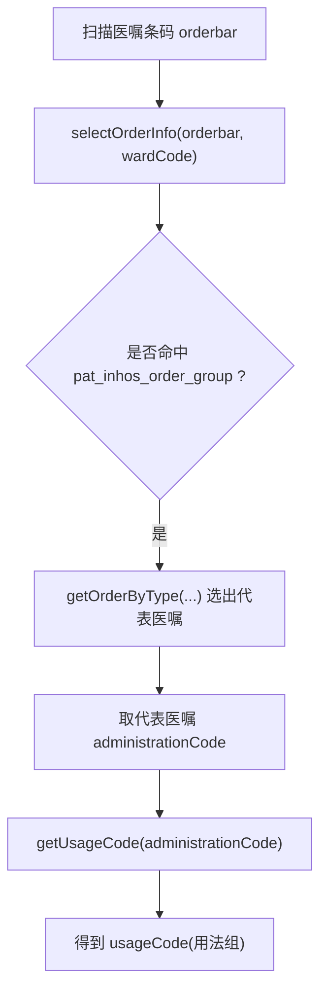

# 医嘱条码如何查询用法和用法组

## 一句话结论

医嘱条码本身不能直接查到用法组，实际链路是：

`orderbar -> 代表医嘱 -> administrationCode(用法编号) -> usageCode(用法组)`

另外要特别区分两个接口方向：

- `selectUsageNumberByUsageGroup(orderUsageGroups)`：`用法组 -> 用法编号`，是反查。
- `getUsageCode(usageNumber)`：`用法编号 -> 用法组`，这才是“医嘱条码查到用法组”真正使用的方法。

## 核心流程



## 代码链路

### 1. 先根据条码查医嘱

`ScanService.selectOrderInfo(orderbar, wardCode)` 里，先调用：

```java
List<PatInhosOrderGroupExt> orderGroups = remotePatInhosOrderGroupApi.findOrderByBar(orderbar);
```

如果查到了，说明这是 `order` 来源。

这里拿到的不是一条医嘱，而可能是一组医嘱。

### 2. 从一组医嘱里选“代表医嘱”

还是在 `selectOrderInfo(...)` 里，会先准备两类辅助数据：

- `allUsageNumbers = selectUsageNumberByUsageGroup(ALL_MEDICINE_USAGE)`
- `nurseCodes = selectUsageNumberByUsageGroup(["UZ"])`

然后调用：

```java
PatInhosOrderGroupExt ext = orderUtils.getOrderByType(orderGroups, allUsageNumbers, nurseCodes, nursingCategory);
```

`getOrderByType(...)` 的优先级是：

1. 先选药品医嘱
2. 其次选护理医嘱
3. 都不是时回退到首条记录

也就是说，后面所有“用法 / 用法组 / 流程类型”的判断，都是基于这个“代表医嘱”继续往下走的。

### 3. 从代表医嘱里取用法编号 administrationCode

选出 `ext` 之后，`selectOrderInfo(...)` 会把它塞进 `OrderbarVO`：

```java
vo.setCode(ext.getAdministrationCode());
```

这里的 `vo.code` 实际上就是：

- `administrationCode`
- 含义：用法编号

所以到这一步，其实已经完成了：

`orderbar -> administrationCode`

### 4. 再由 administrationCode 查询 usageCode

后面在 `processSourceTableOrder(...)` 里，会继续调用：

```java
type = getTypeNameByCode(code);
```

而 `getTypeNameByCode(code)` 最终就是：

```java
return remotePatOrderUsageConfigApi.getUsageCode(adminCode);
```

也就是：

```java
getUsageCode(administrationCode) -> usageCode
```

这个 `usageCode` 就是用法组，例如：

- `INFUSION`
- `ORAL`
- `UZ`
- `NURSING_CARE_CHECK`
- `NURSING_CARE_PATROL`

所以完整链路是：

`orderbar -> orderGroups -> 代表医嘱 ext -> administrationCode -> usageCode`

## 为什么代码里还会出现 `selectUsageNumberByUsageGroup(...)`

这个方法很容易看混。

它的作用不是“根据条码查用法组”，而是：

`先给一批用法组，再查出这些用法组下有哪些用法编号`

例如：

- `selectUsageNumberByUsageGroup(ALL_MEDICINE_USAGE)`：查所有药品类用法组下的用法编号
- `selectUsageNumberByUsageGroup(["UZ"])`：查护理用法组下的用法编号

这些结果会被 `getOrderByType(...)` 用来判断：

- 哪些记录算药品医嘱
- 哪些记录算护理医嘱
- 应该选哪一条作为代表医嘱

所以它是在“选代表医嘱”阶段做辅助判断，不是最后一步查用法组。

## 字段对照

| 字段 | 含义 | 典型来源 |
| --- | --- | --- |
| `orderbar` | 医嘱条码 | 扫码输入 |
| `administrationCode` | 用法编号 | `PatInhosOrderGroupExt.getAdministrationCode()` |
| `usageCode` | 用法组 | `IPatOrderUsageConfigApi.getUsageCode(administrationCode)` |
| `usageName` | 用法名称 | `PatOrderUsageConfig` |
| `usageCodeName` | 用法组名称 | `PatOrderUsageConfig` |

## 如果要同时拿到“用法名称 + 用法组名称”

如果不仅要 `usageCode`，还想拿到：

- `usageName`
- `usageCodeName`

那不要只调用 `getUsageCode(administrationCode)`，而应该直接查：

```java
PatOrderUsageConfig config = remotePatOrderUsageConfigApi.get(administrationCode);
```

这样可以一次拿到：

- `config.getUsageNumber()`
- `config.getUsageName()`
- `config.getUsageCode()`
- `config.getUsageCodeName()`

## 适用范围说明

上面这条“医嘱条码 -> 用法组”的链路，只适用于 `order` 来源。

如果条码最终命中的是：

- `lab`
- `exam`
- `blood`

那 `getGeneralOrderbar` 会直接给出流程类型，不会再沿着“代表医嘱 -> administrationCode -> usageCode”这条链路走下去。

## 最终结论

如果问题是“如何根据医嘱条码查询用法组”，答案应写成下面这句话：

1. 先用条码查 `pat_inhos_order_group`，拿到一组医嘱。
2. 再用 `getOrderByType(...)` 选出代表医嘱。
3. 从代表医嘱取 `administrationCode`。
4. 再调用 `IPatOrderUsageConfigApi.getUsageCode(administrationCode)`，得到 `usageCode`，也就是用法组。

也就是：

`orderbar -> administrationCode -> usageCode`
